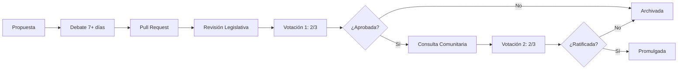

# 🏛️ Constitución Administrativa de Untravel

[](https://creativecommons.org/licenses/by-sa/4.0/)
[](./CHANGELOG.md)
[](https://www.minecraft.net/es-es/about-minecraft)

**Repositorio constitucional oficial de la Unión Untravel** - Comunidad gaming de Minecraft Bedrock

---

## 📖 Sobre Este Repositorio

Este repositorio contiene la **Constitución Administrativa** de la Unión Untravel, un marco de gobierno democrático y meritocrático para nuestra comunidad de Minecraft Bedrock. Aquí se documentan:

- 📜 La Constitución completa con todos sus artículos
- 🔄 El historial de reformas constitucionales
- 💬 Propuestas y debates de la comunidad
- ✅ Proceso de aprobación de cambios
- 📊 Registro histórico inmutable de decisiones

### 🎯 Objetivos

El presente documento establece los principios y estructura de gobierno para la comunidad de la Unión Untravel en Minecraft Bedrock, con el objetivo de garantizar:

- ⚖️ **Justicia**: Trato equitativo para todos los jugadores
- 🤝 **Igualdad**: Oportunidades para todos sin discriminación
- 🗽 **Libertad**: Participación activa en la toma de decisiones
- 🏆 **Mérito**: Reconocimiento basado en contribuciones reales
- 🔍 **Transparencia**: Procesos abiertos y documentados

---

## 🏗️ Estructura del Repositorio

```
📁 Constitución-Administrativa-de-Untravel/
├── 📄 README.md                    # Este archivo
├── 📜 CONSTITUTION.md              # Constitución completa
├── 📋 CHANGELOG.md                 # Historial de reformas
├── 🤝 CONTRIBUTING.md              # Guía para contribuir
├── ⚖️ LICENSE                      # CC BY-SA 4.0
├── 📁 reformas/                    # Archivo de reformas históricas
│   ├── 📁 aprobadas/              # Reformas implementadas
│   ├── 📁 en-proceso/             # Reformas en debate
│   └── 📁 rechazadas/             # Reformas no aprobadas
└── 📁 .github/                    # Configuración de GitHub
    ├── 📁 ISSUE_TEMPLATE/         # Plantillas para Issues
    │   ├── reforma.md             # Propuesta de reforma
    │   ├── mejora.md              # Sugerencia de mejora
    │   └── error.md               # Reporte de error
    ├── PULL_REQUEST_TEMPLATE.md   # Plantilla para PRs
    └── 📁 workflows/              # GitHub Actions
        └── validacion.yml         # Validación automática
```

---

## 🏛️ Sistema de Gobierno

Nuestra comunidad se organiza bajo un sistema **tripartito de poderes** con características democráticas y meritocráticas:

### 👔 Poder Ejecutivo
- **Función**: Administración y gestión diaria
- **Composición**: Presidente, Vicepresidente, Ministros
- **Elección**: Voto directo de la comunidad
- **Mandato**: 3 meses (renovable una vez)

### 🏛️ Poder Legislativo
- **Función**: Crear, modificar y derogar leyes
- **Composición**: Congreso Untravel (representantes electos)
- **Elección**: Voto directo proporcional
- **Mandato**: 2 meses (renovable)

### ⚖️ Poder Judicial
- **Función**: Garantizar cumplimiento y resolver conflictos
- **Composición**: Tribunal Supremo (3-5 jueces)
- **Selección**: Por mérito e imparcialidad
- **Mandato**: 4 meses (no renovable consecutivamente)

---

## 📚 Documentos Principales

| Documento | Descripción | Enlace |
|-----------|-------------|--------|
| 📜 **Constitución** | Texto completo con todos los artículos | [CONSTITUTION.md](./CONSTITUTION.md) |
| 📋 **Changelog** | Historial de todas las reformas | [CHANGELOG.md](./CHANGELOG.md) |
| 🤝 **Contribuir** | Guía para proponer reformas | [CONTRIBUTING.md](./CONTRIBUTING.md) |
| ⚖️ **Licencia** | Términos de uso (CC BY-SA 4.0) | [LICENSE](./LICENSE) |

---

## 🚀 Cómo Participar

### Para Jugadores Nuevos

1. **Lee la Constitución**: Familiarízate con nuestros principios y estructura
2. **Únete al servidor**: Comienza a participar en la comunidad
3. **Observa y aprende**: Entiende cómo funcionan los procesos
4. **Participa**: Comparte ideas en Issues o debates comunitarios

### Para Proponer Reformas

1. **Revisa la guía**: Lee [CONTRIBUTING.md](./CONTRIBUTING.md) completamente
2. **Crea un Issue**: Usa la plantilla de "Propuesta de Reforma"
3. **Debate público**: Participa en la discusión (mínimo 7 días)
4. **Pull Request**: Si hay consenso, formaliza los cambios
5. **Proceso legislativo**: Sigue el procedimiento oficial de votación

### Para Votar y Opinar

- 💬 Comenta en Issues de propuestas activas
- 👍 Reacciona para mostrar apoyo (o 👎 para desacuerdo)
- 🗳️ Participa en votaciones cuando seas elegible
- 📣 Difunde propuestas que consideres importantes

---

## 🔄 Proceso de Reforma Constitucional



**Requisitos para iniciar reforma:**
- 1/3 del Legislativo, O
- Poder Ejecutivo, O
- 20% de firmas de comunidad activa, O
- Recomendación del Tribunal Supremo

---

## 📊 Versionado Semántico

Las reformas siguen el sistema **SemVer** (X.Y.Z):

- **MAJOR** (X.0.0): Cambios estructurales fundamentales
- **MINOR** (x.X.0): Nuevos artículos sin romper lo existente
- **PATCH** (x.x.X): Correcciones o aclaraciones menores

**Versión actual**: `1.0.0`

---

## 🔒 Protección de Marca

La marca **"Untravel"** y sus variantes están protegidas y pertenecen a la comunidad. Su uso comercial o público requiere autorización explícita del Poder Ejecutivo de la Unión Untravel.

---

## ✅ Validación Automática

Este repositorio utiliza **GitHub Actions** para validar automáticamente:

- ✅ Formato Markdown correcto
- ✅ Sintaxis y estructura del documento
- ✅ Versionado semántico apropiado
- ✅ Actualización del CHANGELOG
- ✅ Coherencia de referencias entre documentos

---

## 🛡️ Protección de Branches

- **Branch `main`**: Protegida, solo merge mediante PR aprobado
- **Requiere**: Revisión de al menos 2 miembros del Legislativo
- **Requiere**: Checks de GitHub Actions pasando
- **Requiere**: Resolución de conversaciones antes de merge

---

## 📜 Licencia

Esta Constitución está licenciada bajo [Creative Commons Attribution-ShareAlike 4.0 International](https://creativecommons.org/licenses/by-sa/4.0/).

Eres libre de:
- ✅ Compartir y redistribuir
- ✅ Adaptar y transformar

Bajo estas condiciones:
- 🔗 **Atribución**: Dar crédito apropiado
- 🔄 **CompartirIgual**: Usar la misma licencia
- 🏷️ **Marca**: La marca "Untravel" requiere autorización

---

## 🤝 Comunidad

- **Servidor Minecraft**: [Información de conexión en Discord]
- **Discord**: [Enlace al servidor de Discord]
- **GitHub Issues**: Para propuestas y debates oficiales
- **GitHub Discussions**: Para conversaciones generales

---

## 📞 Contacto

- **Poder Ejecutivo**: [Contacto del Presidente actual]
- **Poder Legislativo**: [Contacto del Congreso]
- **Poder Judicial**: [Contacto del Tribunal]
- **Soporte Técnico**: Abre un Issue en este repositorio

---

## 🎮 Sobre Untravel

La **Unión Untravel** es una comunidad dedicada a Minecraft Bedrock que valora:

- 🎯 La excelencia en construcción y gameplay
- 🤝 La colaboración y el trabajo en equipo
- ⚖️ La justicia y el trato equitativo
- 🏆 El reconocimiento del mérito y esfuerzo
- 🗳️ La participación democrática de todos

**¡Únete a nosotros y sé parte de una comunidad que valora tu voz!**

---

## 📈 Estadísticas

- **Versión Constitucional**: 1.0.0
- **Última actualización**: 2024
- **Reformas aprobadas**: 0
- **Miembros activos**: [Actualizar según comunidad]
- **Branches protegidos**: 1 (main)

---

## 🙏 Agradecimientos

Gracias a todos los miembros de la Unión Untravel que han contribuido a crear y mantener este marco constitucional. Este documento es el resultado del esfuerzo colectivo por construir una comunidad justa, transparente y democrática.

---

**Por la justicia, la igualdad y la libertad en Untravel** 🏛️⚖️🗽

*Última actualización: 2024 | Mantenido con ❤️ por la comunidad Untravel*